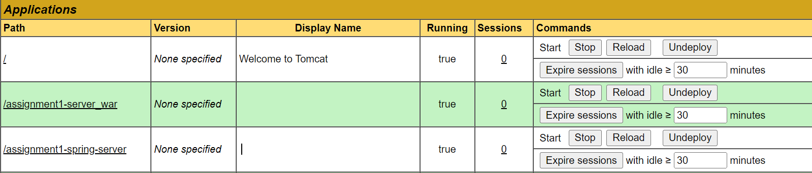
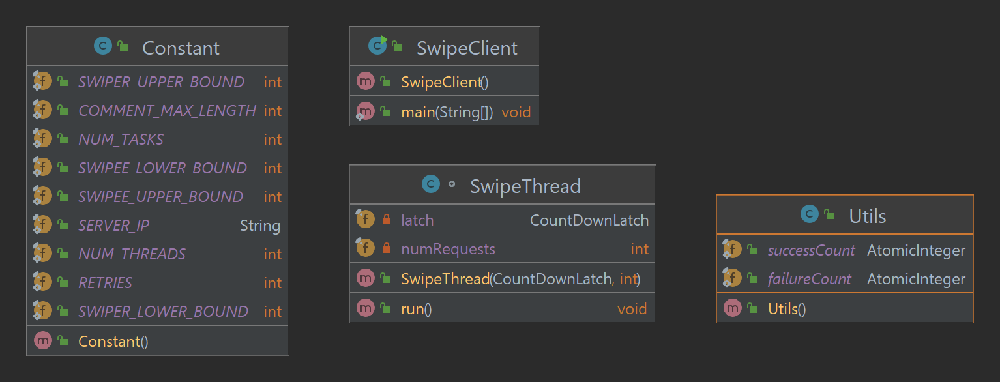
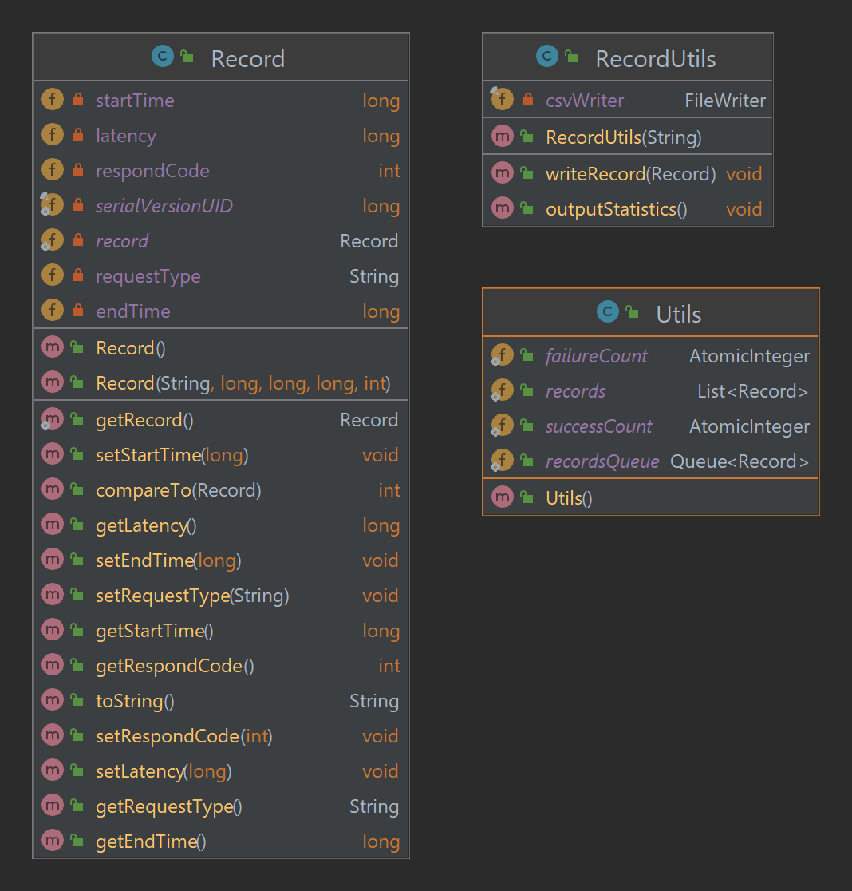
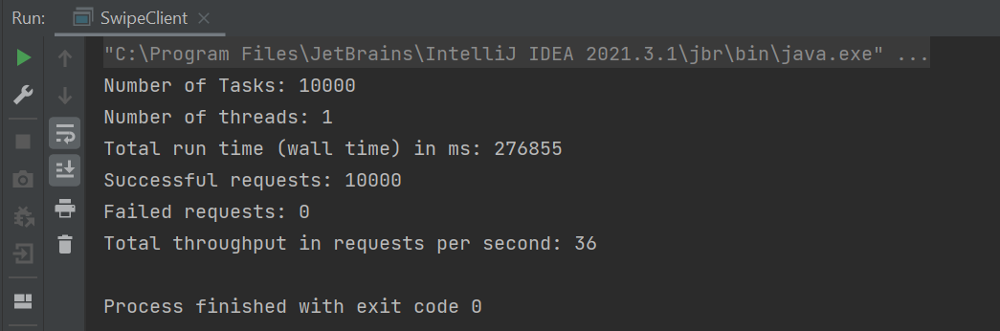
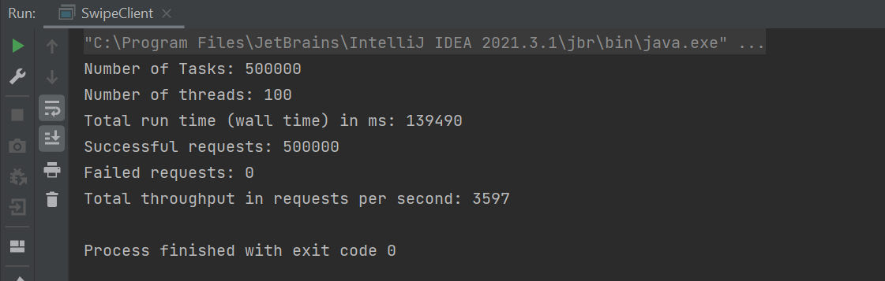
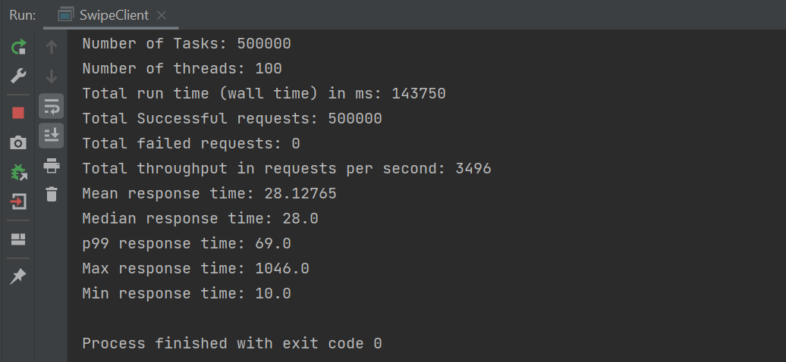
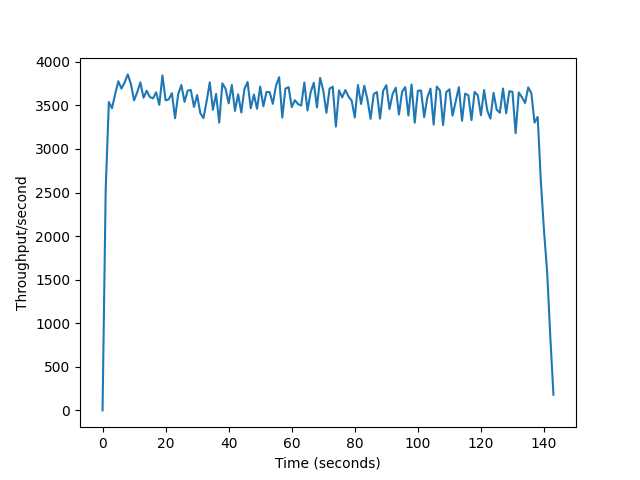
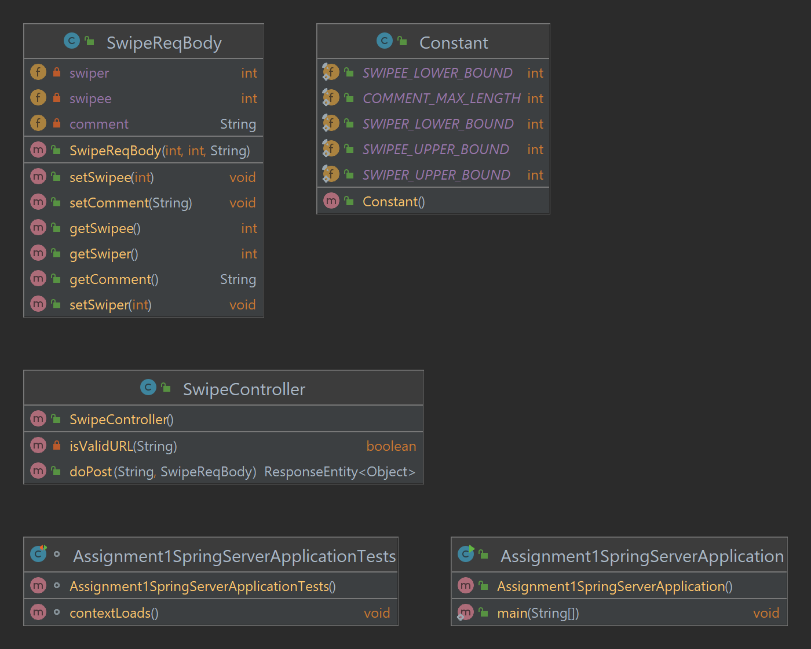

CS6650 Assignment1 Report

Xiaohan Qin 2/9/2023


**Server Implementation**

- Implemented a regular java servlet and a spring servlet which can handle http POST request and return response as expected in [Swagger](https://app.swaggerhub.com/apis/IGORTON/Twinder/1.0.0).
- Deployed the servlets to EC2 Tomcat. Base path are:

http://{Server's public IP} /assignment1-server\_war/

http://{Server's public IP} /assignment1-spring-server/

- Tomcat web interface shows applications up and running:



&nbsp;
**Client Design**

_part 1_



- Part 1 has four parts: Constant, SwipeClint, SwipeThread, and Utils.
- Constant stores all constant variables such as server IP and swipe request body constraints.
- SwipeClient is the main class, it reads value from the Constant class, creates the thread pool, and submit tasks to threads.
- SwipeThread is the per client request model, it creates the swipe details using ```ThreadLocalRandom``` and submits the POST requests to server. It also updates the total success and failure count in the process.
- Utils stores the global ```AtomicInteger``` variables successCount and failureCount.

_Part 2_



- On top of part 1, part 2 adds two classes – Record and RecordUtils. It also modifies Utils class and uses ```ConcurrentLinkedQueue``` as a thread-safe way to store all records.
- Record models the per request details including requestType, startTime, endTime, latency, and status code.
- RecordUtils class imports the FileWriter and is used to write all records to csv files. It also calculates statistics such as mean, median, min and max latency.   

&nbsp;
**Client Outputs**

_Part 1 – 1 thread, 10k requests_

- Ran client part 1 with one thread and 10k requests to calculate the average request latency for future throughput estimation.



W (average latency) = 276855 ms / 10000 = **27.6855 ms**

_Part 1 – 100 threads, 500k requests_



- Little's Law Verification

W (average latency) = 27.6855 ms

N (amount of concurrency) = 100

Estimated throughput = 100 / 0.0276855 = **3611** requests per second, which is close to our actual throughput **3597**.

_Part 2 – 100 threads, 500k requests_



- Little's Law Verification

W (average response time) = 28.12765 ms

N (amount of concurrency) = 100

Estimated throughput = 100 / 0.02812765 = **3555** requests per second, which is close to our actual throughput **3496**.

- Compared with client part 1 with the same config

Throughput from part 1 is 3597.

Throughput from part 2 is 3496.

0.95 \* 3597 \< 3496 \< 1.05 \* 3597

Thus part 2 throughput is **within 5%** of the results from client part 2.

- Statistics

**Mean, median, p99, max,** and **min** latency are **28.1, 28.0, 69.0, 1046.0,** and **10.0** respectively, as shown in the screenshot

&nbsp;
**Performance Plot**

- I used Python ```matplotlib``` library to draw performance chart, where the x-axis is time in seconds (from 0 – wall time), and the y-axis is throughput per second, showing the number of requests completed in each second of the test.
- Configuration for the test is 100 threads and 500k requests.
- As the result chart shows, total execution time/wall time is 140+ seconds, and the throughput per second drops within the range of 3k – 4k, which reflects the terminal outputs from client part 2.



&nbsp;
**Spring server**

- I implemented the servlet logic using spring framework.
- Post requests are handled in SwipeController and requests are validated in SwipeReqBody using the ```validation``` library.
- Tested it with client part 1 using 100 threads and 500k requests.
- The total throughput, **2262**, is a bit **lower** than regular java servlet.
- Assumption is Spring framework adds lots of additional functionality beyond basic Java servlet, such as comprehensive dependency injection and security, which adds some overhead to the processing and thus causes more time.


