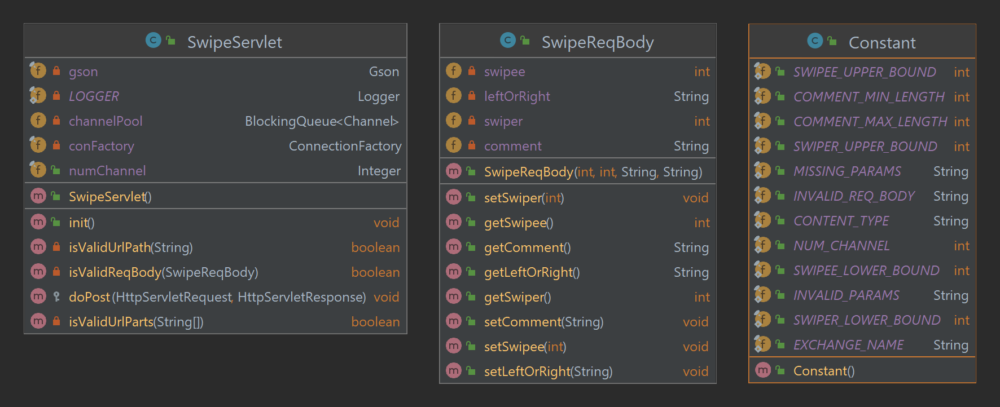
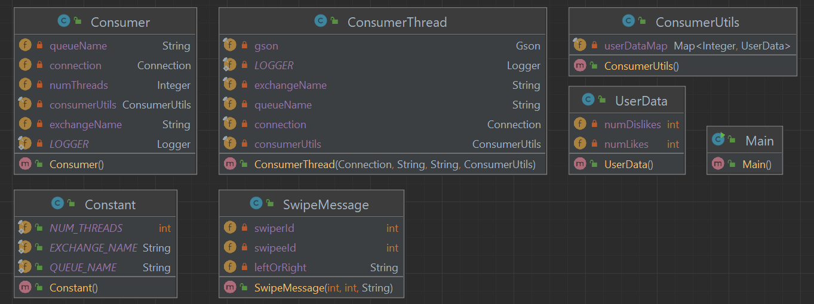
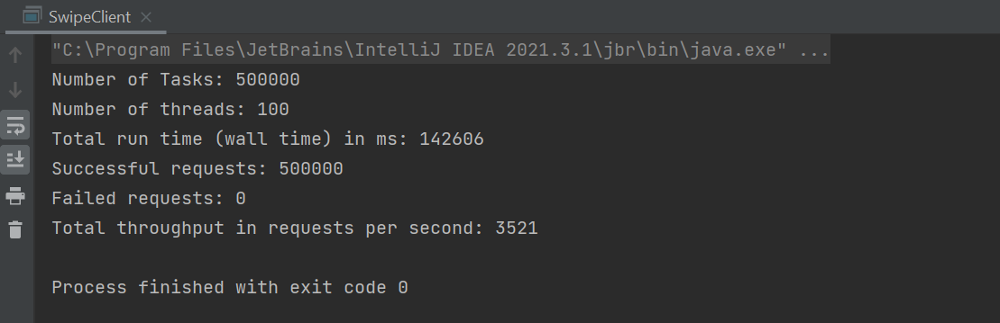
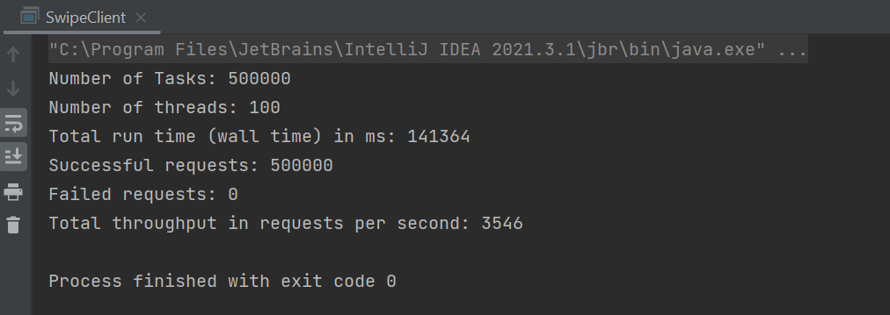
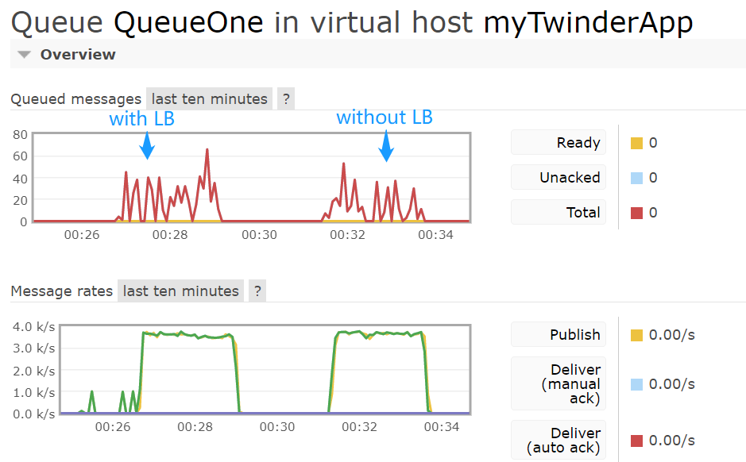
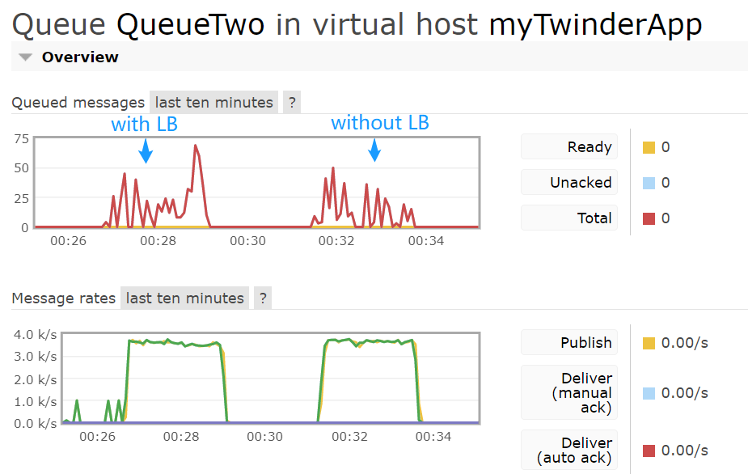

CS6650 Assignment2 Report

Xiaohan Qin 2/28/2023

**GitHub Repo**
- [https://github.com/Xiaohan-Qin/twinder-distributed-system/tree/master/assignment2](https://github.com/Xiaohan-Qin/twinder-distributed-system/tree/master/assignment2)

***
**RabbitMQ**
I deployed RabbitMQ message broker on an Ubuntu EC2 instance following [this instruction](https://www.cherryservers.com/blog/how-to-install-and-start-using-rabbitmq-on-ubuntu-22-04).

***
**Server Design**
- I adopted the design of server from previous assignment.
- The main changes are in SwipeServlet class.

- When client requests come in, before handling post requests, the servlet first creates a connection to RabbitMQ using ConnectionFactory by scanning the "rabbitmq.conf" file inside the source directory. 
The file tells RabbitMQ's IP address, port number, user name, password, and virtual host name line by line.
  ```
  172.31.30.194
  5672
  xiaohan
  cs6650
  myTwinderApp
  ```
- Since my servlet and RabbitMQ are deployed to the same subnet on AWS, RabbitMQ's private IPv4 is used when connecting from the servlet. 
However, when connected from outside networks such as my local machine, RabbitMQ's public IPv4 should be used.
- After the connection is established, the server creates a channel pool of size 10 using BlockingQueue to store channels for later use.
- Now it is time to actually handle the requests in the doPost() method. For each post request, the servlet first validates it using Gson library and does some message processing.
- If validation check is passed, the servlet would take an idle channel from the queue, publish the message to a fanout exchange, and add the channel back to the queue for future use.
  ```
  channel.basicPublish(Constant.EXCHANGE_NAME, "", null, message.getBytes());
  response.setStatus(HttpServletResponse.SC_CREATED);
  LOGGER.info("Sent " + message + " to rabbitmq");
  response.getWriter().write("Sent " + message + " to rabbitmq");
  channelPool.add(channel);
  ```
- As for the message, it should be sent by the exchange to all bounded queues!

***
**Consumer Design**
- I implemented two plain old java programs to consume massages from the queue. They are responsible for the following purposes when processing messages.
- Consumer1: Given a user id, return the number of likes and dislikes this user has swiped.
- Consumer2: Given a user id, return a list of 100 users maximum who the user has swiped right on. These are potential matches.
- Use consumer1 as an example, it applies the thread per channel model and has five parts: 
**Consumer** - used to set up connection to the RabbitMQ and finalize the exchange and queue name for its future threads. 
**ConsumerThread** – a runnable that creates an independent channel, declares exchange and queue and bind them together, and consumes messages. 
**ConsumerUtils** – the class that process dequeued messages using a ConcurrentHashMap data structure. 
**UserData** – stores the number of likes and dislikes a user has swiped. 
**Constant** – stores all constant values. 
**Main** – the entry point of program. It creates a thread pool of size 100 so that threads can consume messages concurrently.

- As for consumer2, all classes except UserData are identical with consumer1. See codes for detailed implementation.

***
**Load Balancer**
- I created another server instance using AMI image based on my original server, and applied load balancing (AWS ELB) across these two servers.

***
**Performance Comparison – Throughput & Queue Length**
- Client Config: Number of requests is **500K**. Number of threads is **100**.
- **With load Balancing – throughput 3521**
  - Sent requests to load balancer. Base path is: http://{Load balancer's DNS}:8080 /assignment2-server/
  - Run result from client console:
   
- **Without load balancing - throughput 3546**
  - Sent requests to a single servlet. Base path is: http://{Server's public IP}:8080 /assignment2-server/
  - Run result from client console:
  
- **RabbitMQ**
- Below are the RabbitMQ web interfaces showing the queue length while program running, where QueueOne is bound with consumer1, and QueueTwo is bound with consumer2.
I did the tests back-to-back so performances can be seen from the same window.



***
**Observation**
- With multiple servers load balanced, throughput is slightly enhanced - from 3521 to 3546 - but definitely not significant.
- Queue length is slightly longer when servers are load balanced compared with a single server.
- Message rates look close with or without load balancing.
- In general, throughputs remain similar to last assignment, and queue length look healthy with or without load balancer, which are below 100 in both cases.
- Assumption of insignificant throughput improvement is there are bottlenecks elsewhere in the system, such as my local machine which runs the client and sends requests to the ec2 servlets.