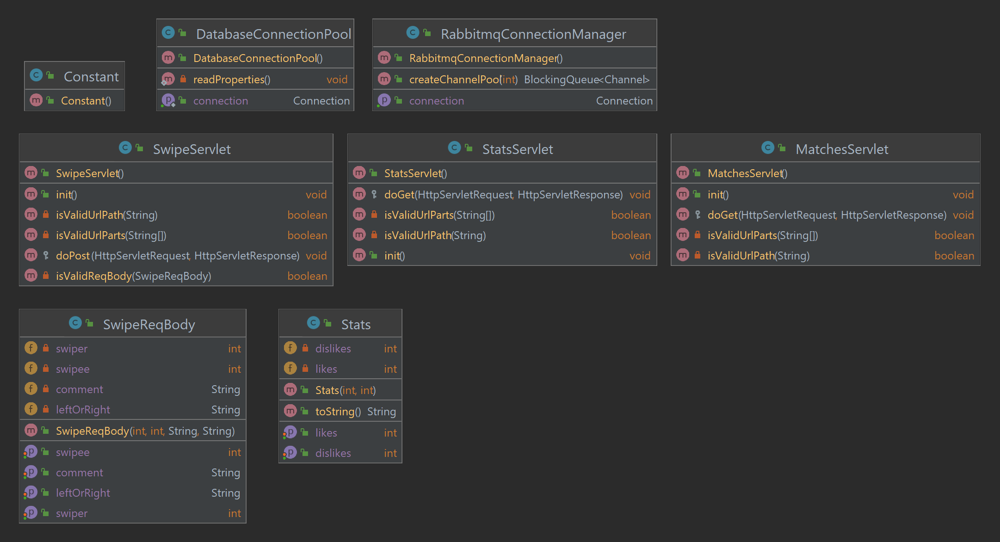
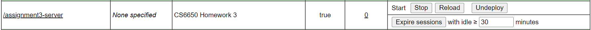
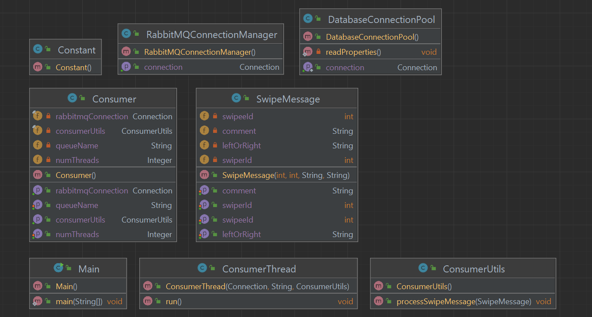
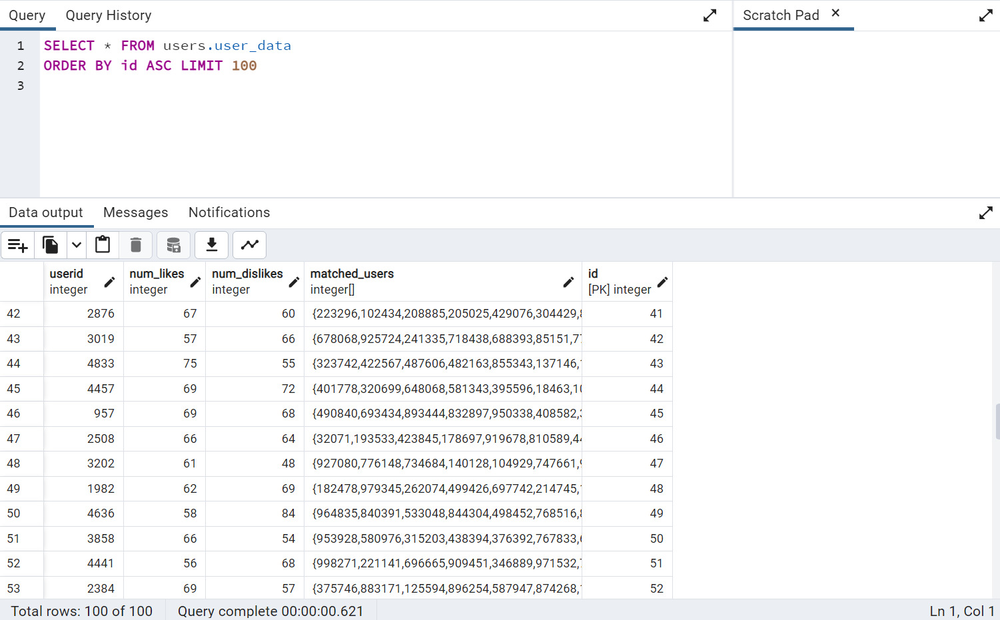
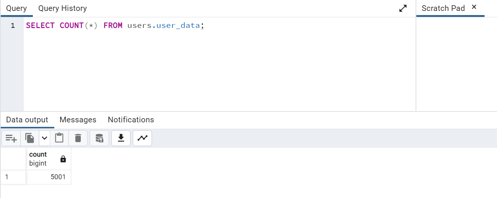
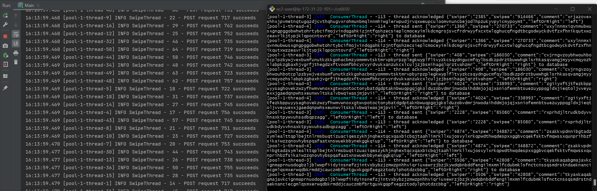
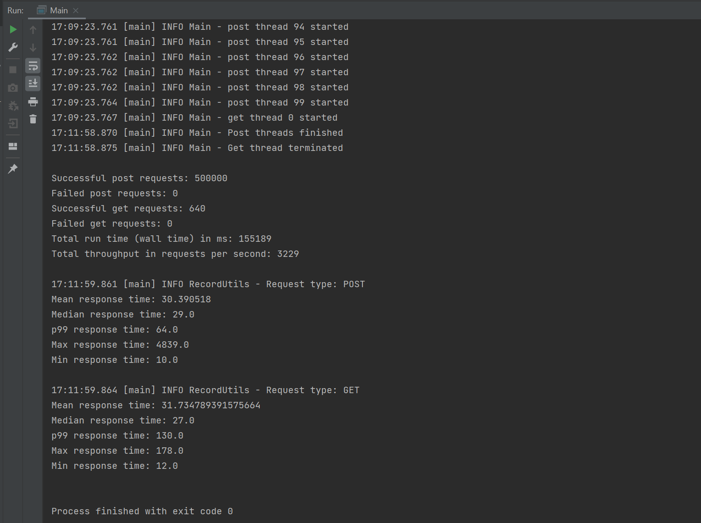
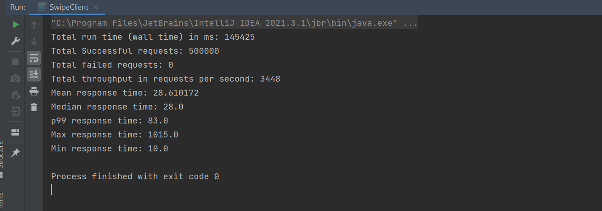

CS6650 Assignment3 Report

Xiaohan Qin 4/2/2023

## GitHub Repo

- [https://github.com/Xiaohan-Qin/twinder-distributed-system/tree/master/assignment3](https://github.com/Xiaohan-Qin/twinder-distributed-system/tree/master/assignment3)

## Architecture

In this assignment, I implemented a distributed system architecture that consists of a server, a
message broker, a consumer, a database, and a client application.

- The server has three servlets that can handle POST and GET requests as expected
  in [Swagger](https://app.swaggerhub.com/apis/IGORTON/Twinder/1.2.1).
- When a POST request comes in, the POST servlet sends it to RabbitMQ for temporary storage and the
  consumer then consumes the messages and stores them in an AWS RDS PostgreSQL database
  persistently.
- When a GET request comes in, The GET servlets retrieve data directly from the database and respond
  to the requests.
- The client application is designed to simulate a large volume of load on the server. It sends
  500K+ requests with a pool of 100 post threads and a single get thread. It also records the
  throughput and latencies for POST and GET requests separately.

## Sever

  

- I built the server based on previous assignments. Apart from SwipeServlet, which handles the post
  requests, the server now runs two more GET servlets: MatchesServlet, and StatsServlet.
- I created a DatabaseConnectionPool class and a RabbitmqConnectionManager class to capsulize any
  connection events, such as getting a db connection and creating a RabbitMQ channel pool of given
  size to make the server more efficient and scalable. Both classes use ConcurrentLinkedQueue to
  store ready-to-use connections.
- The SwipeReqBody class is used to verify the POST request body before sending it to the broker.
- The Stats class is used by the StatsServlet to log http response from GET requests as an object.
- Server is deployed to tomcat EC2 instance, with the base path being http://{Server's public IP}
  /assignment3-server/

  

## Message Broker

  I am using the existing RabbitMQ EC2 instance from previous assignment for message broker. It is
  responsible for storing post messages from the servlet before they are consumed by the consumer. The
  only change is that the queue is now durable, meaning it is capable of surviving internet crashes
  and provides persistent storage of data, whereas the non-durable queue I was using did not.

## Consumer

  

- Based on previous assignment, I built a consumer program that consumes messages from the durable
  queue and updates database according to the messages.
- ConsumerUtils class handles the actual update of the database based on the following rules:

  - If the swiperID is not yet in the database, directly insert a new row with the given values.
  - If the swiperID is already in the database, check if he or she has already matched with the
    swipee.
  - If the swiper has not yet matched with the swipee and he or she swiped right, increase the
    num\_likes column and append the swipeeID into the matched\_users array.
  - If the swiper has not yet matched with the swipee and he or she swiped left, increase the
    num\_dislikes column.
  - If the swiper has already matched with the swipee, do nothing.

## Database

- I am using AWS RDS **PostgreSQL** for database.
- It is responsible for recording the number of likes and dislikes a user has swiped, and the list
  of userid who the user has swiped right on.
- In the database, I created a database called my\_twinder\_app, a schema called users, and a table
  called user\_data.
- The user\_data table has 5 columns: **userid (unique int), num\_likes (int), num\_dislikes (int),
  matched\_users (int[]), and id (int primary key)**.
- The following screenshots shows part of the user\_data table. After inserting, it has 51 rows in
  total, as the range of swiperID is 0-5000, meaning each swiper has its own row in the table.

  

  

## Client output

The client is designed to simulate a large volume load on the server. Apart from what's in the
previous client program, which uses 100 post threads to send 500k post requests to the servlet, it
now has an additional single GET thread. The GET thread is started after all post threads have
started. It generates 5 requests with random data every second, and is terminated immediately after
the last post thread is terminated.

The client also keeps track of the latencies of every single POST and GET request. It stores the
latency data in csv files separately for POST and GET requests. The csv files are stored in 
*assignment3-client/res/records* directory.

Here is a screenshot showing the client and the consumer program running.

Time to see the console output! The first half of the output shows the overall statistics of the client program. It includes
the total number of successful POST requests, the total number of successful GET requests, the wall
time, and the throughput. The following screesnhot shows that the client sends 500k successful post
requests and 640 successful get requests to the server. Throughput is **3299** requests per second,
which is calculated by dividing the total number of requests (500640) by the wall time (155.189s)
. 

The second half of the console output shows the latency details of POST and GET requests
respectively. We can see that the mean POST request latency is **30.4ms** and the mean GET request 
latency is **31.7ms**.

## Compared with previous assignment

I ran the client for assignment 2 again to get its throughput and latency for comparison (as shown in the screenshot). 
We can see that the throughput from a2 is 3448, and the mean latency from a2 is 28.6. Compared with assignment 2, our current
throughput is a bit lower and the latency is a bit longer, but are both within the 10% range of it.

 