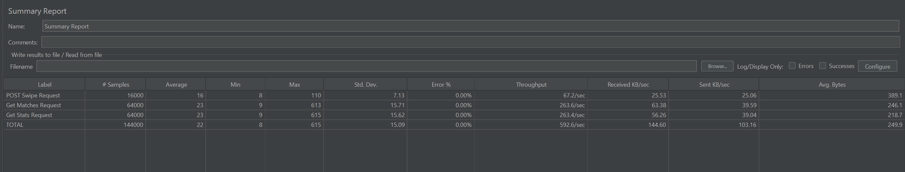

CS6650 Assignment4 Report

Xiaohan Qin 4/18/2023

## GitHub Repo

- [https://github.com/Xiaohan-Qin/twinder-distributed-system/tree/master/assignment4](https://github.com/Xiaohan-Qin/twinder-distributed-system/tree/master/assignment4)

## CQRS Pattern

In this assignment, I applied the CQRS pattern to the Twinder application, separating the read and
write operations into distinct components. Here are the simplified changes based on previous
assignments:

1. Split the server into Command and Query Services:
    - Command Service: Handles write operations, processes POST requests for swipes, and sends
      messages to the message broker. A consumer updates the write data store.
    - Query Service: Handles read operations, processes GET requests for matches and stats, and
      reads data directly from the read data store. from the read data store.
2. Use separate data stores for read and write operations:
    - AWS Aurora DB cluster: Utilized for both read and write instances, with automatic syncing
      between the writer and reader instances.
3. Assign each server its corresponding data store:
    - Command Service connected to the write data store.
    - Query Service connected to the read data store.

Here is a graph of the current structure.

## JMeter Load Test

I used Apache JMeter to load testing the Twinder application. Below are some screenshots from the
JMeter ouptput:

- GET Stats response
  
- GET Matches response
  
- Summary report
  

## Future Improvement

- Increase message broker performance: Consider using more efficient message streaming application
  such as Apache Kafka.
- Implement caching: Consider implementing caching at the application level to reduce the number of
  read requests to the database. Use in-memory caching solutions like Redis or Memcached to store
  frequently accessed data.